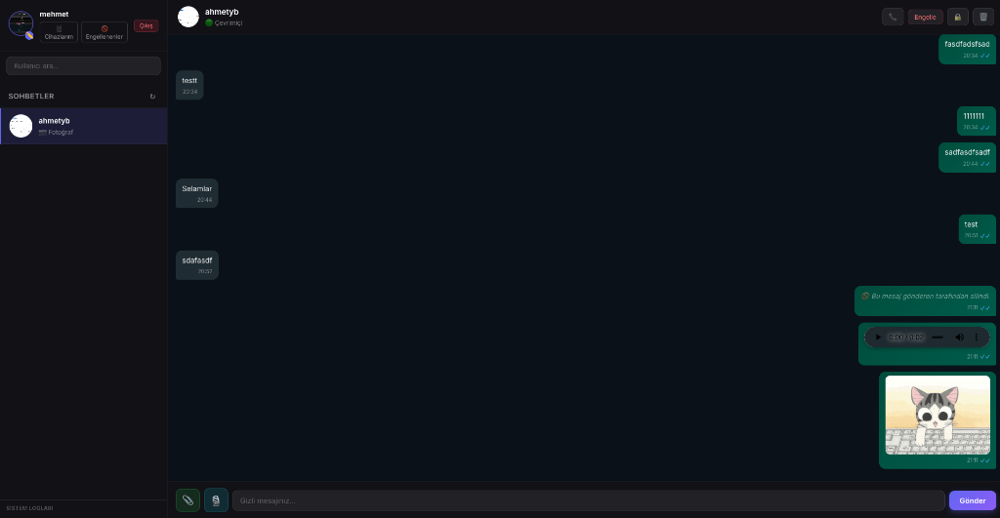

# 🔒 Secure Stealth-Chat (Private Messaging) Client

[Turkish (Türkçe)](#türkçe-ürün-açıklaması-ve-kılavuz) | [English](#english-product-description-and-guide)

---

## Türkçe (Ürün Açıklaması ve Kılavuz)

### 🚀 Nedir ve Neden Var?
**Secure Stealth-Chat**, kullanıcıların gizliliğini ve veri güvenliğini en üst düzeyde tutmak amacıyla tasarlanmış, **Uçtan Uca Şifreli (End-to-End Encrypted - E2EE)** modern bir anlık mesajlaşma uygulamasıdır. 

Geleneksel mesajlaşma platformlarının aksine, mesajlarınız sunucu dahil hiçbir üçüncü taraf tarafından okunamaz. Anahtarlarınız ve verileriniz tamamen sizin cihazınızda üretilir, şifrelenir ve saklanır.

### 📸 Ekran Görüntüsü


### 🛠️ Öne Çıkan Özellikler
*   **Uçtan Uca Şifreleme (E2EE):** Mesajlar alıcıya ulaşana kadar şifreli kalır. Şifreleme işlemleri için modern **Web Crypto API** standartları kullanılır.
    *   **ECDH (Elliptic Curve Diffie-Hellman):** Güvenli anahtar değişimi için kullanılır.
    *   **AES-GCM (256-bit):** Mesajların yüksek performanslı ve güvenli şifrelenmesi için kullanılır.
    *   **ECDSA (Elliptic Curve Digital Signature Algorithm):** Mesajların doğruluğunu ve gönderici kimliğini doğrulamak (imzalamak) için kullanılır.
*   **PIN Korumalı Yerel Güvenlik:** Hassas özel anahtarlarınız (Private Keys), cihazınızda **PBKDF2** (200.000 iterasyon, SHA-256) algoritması ve belirlediğiniz PIN kodu ile şifrelenerek saklanır.
*   **Yerel Veri Saklama (IndexedDB):** Sohbet geçmişiniz, anahtarlarınız ve oturum bilgileriniz tarayıcınızın güvenli yerel veritabanı olan **IndexedDB** üzerinde şifreli olarak depolanır.
*   **Gerçek Zamanlı İletişim:** **SignalR** (WebSockets) altyapısı sayesinde anlık mesaj iletimi, çevrimiçi/çevrimdışı durumu ve okundu bilgileri anlık olarak senkronize edilir.
*   **Zengin İçerik Paylaşımı:** Sesli mesaj (ses kaydı) gönderme, fotoğraf/dosya ekleme ve mesaj silme (gönderen tarafından silinen mesajlar karşı taraftan da temizlenir) özellikleri mevcuttur.
*   **Gizlilik Yönetimi:** İstenmeyen kullanıcıları engelleme ve cihaz yönetimi.

---

### 💻 Kurulum ve Çalıştırma

Projeyi yerel makinenizde çalıştırmak için aşağıdaki adımları izleyin:

#### 1. Gereksinimler
*   [Node.js](https://nodejs.org/) (v18 veya üzeri önerilir)
*   Uyumlu çalışan bir backend (SignalR Hub ve Anahtar Sunucusu)

#### 2. Paketlerin Kurulması
```bash
npm install
# veya
yarn install
```

#### 3. Geliştirme Sunucusunu Başlatma
```bash
npm run dev
# veya
yarn dev
```
Tarayıcınızda [http://localhost:3000](http://localhost:3000) adresine giderek uygulamayı test edebilirsiniz.

---

## English (Product Description and Guide)

### 🚀 What is it and why does it exist?
**Secure Stealth-Chat** is a modern **End-to-End Encrypted (E2EE)** instant messaging web application designed to prioritize user privacy and data security above all else. 

Unlike traditional messaging platforms, your messages cannot be read by any third party, including the central server. Your cryptographic keys and chat history are generated, encrypted, and stored entirely on your local device.

### 📸 Screenshot


### 🛠️ Key Features
*   **End-to-End Encryption (E2EE):** Messages remain encrypted until they reach the recipient. Cryptographic operations leverage the industry-standard **Web Crypto API**:
    *   **ECDH (Elliptic Curve Diffie-Hellman):** Used for secure key exchange between peers.
    *   **AES-GCM (256-bit):** Used for high-performance, authenticated message encryption.
    *   **ECDSA (Elliptic Curve Digital Signature Algorithm):** Used for signing and verifying message authenticity and sender identity.
*   **PIN-Protected Local Security:** Sensitive private keys are encrypted on your device using **PBKDF2** (200,000 iterations, SHA-256) combined with a user-defined PIN code.
*   **Local Secure Cache (IndexedDB):** Chat history, keys, and session metadata are stored securely inside your browser's **IndexedDB**.
*   **Real-Time Connection:** Powered by **SignalR** (WebSockets) for instant message delivery, online/offline status updates, and read/delivery receipts.
*   **Rich Media & Message Control:** Supports voice/audio messages, photo attachments, and message revocation (deleting a message removes it from both sides).
*   **Privacy Controls:** Block/unblock users and manage registered devices.

---

### 💻 Installation and Running

Follow the steps below to run the project locally:

#### 1. Prerequisites
*   [Node.js](https://nodejs.org/) (v18 or newer recommended)
*   A running instance of the companion backend service (SignalR Hub & Key Service)

#### 2. Install Dependencies
```bash
npm install
# or
yarn install
```

#### 3. Run the Development Server
```bash
npm run dev
# or
yarn dev
```
Open [http://localhost:3000](http://localhost:3000) in your browser to view the application.
